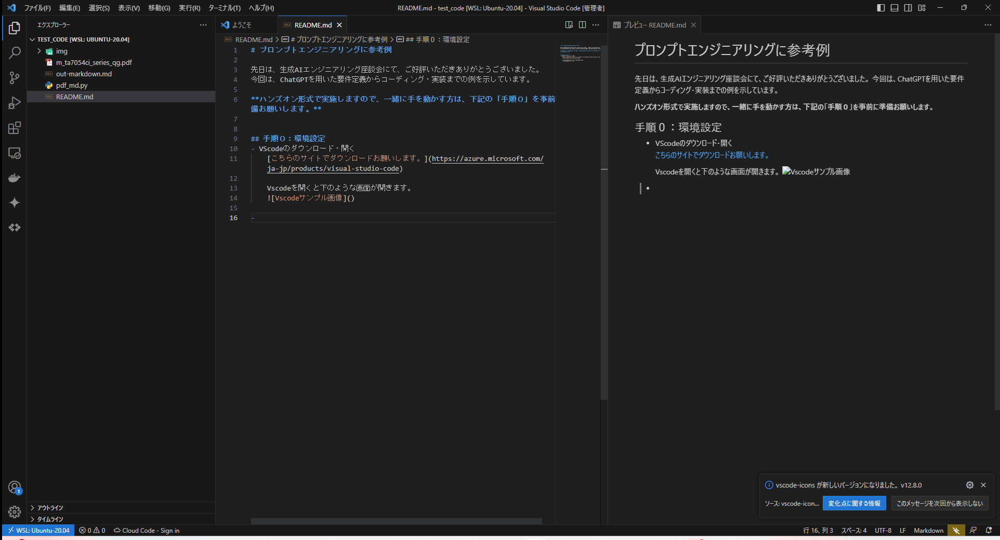

# プロンプトエンジニアリングに参考例

先日は、生成AIエンジニアリング座談会にて、ご好評いただきありがとうございました。
今回は、ChatGPTを用いた要件定義からコーディング・実装までの例を示しています。  

**ハンズオン形式で実施しますので、一緒に手を動かす方は、下記の「手順０」を事前に準備お願いします。**  

## 手順０：環境設定
- VScodeのダウンロード・開く  
    [こちらのサイトでダウンロードお願いします。](https://azure.microsoft.com/ja-jp/products/visual-studio-code)

    Vscodeを開くと下のような画面が開きます。
    

- 「拡張機能」→検索「Python」でPythonをダウンロードしてください。
    

- 仮想環境構築  
    この作業は、今後Pythonを用いて開発する際に、開発環境を分ける為に使います。

    1. 仮想環境を作成するディレクトリに移動する
    1. 「ターミナル」→「新しいターミナル」で、ターミナルを開く
    1. 以下のコマンドで仮想環境を作成する
        > python -m venv venv
    1. 仮想環境をアクティベートします：  
        - Windows:  
            > .\venv\Scripts\activate
        - macOS/Linux:
            > source venv/bin/activate

※　以下要件定義は２つの手順を示しています。お好きな方法でアプリケーションを作成してください。

## 手順２：要件定義してもらおう（対話しながら、要件定義と実装）
- プロンプト入力
    [こちらのQiita記事を参考に](https://qiita.com/ishitoki47259/items/a559c2527060fc342462)  

        あなたはバックエンド開発者です。
        あなたが持っている技術スタックは、Python、Flaskです。

        あなたの最終目標は、私の要求を満たすアプリケーションのソースコードを作成することです。

        以下のプロセスに従ってソースコードを作成してください。

        ステップ1：アプリケーションの要件を確認する
            a) 現在の要求事項を表示する
                アプリケーションの要件を理解した上で、箇条書きにしてください。
            b) 質問と改善
                応募要件を洗練させたり改善するために、私に質問してください。
                私はそれらに答えるか、さらなる要望を伝え、お客様はそれに応じて要件を修正することができます。
            c) 繰り返し
                私が「OK」と言うまで、ステップa)とb)を繰り返してください。
                私がOKを出したら、ステップ2へお進みください。

        ステップ2：コード化
            a) 現在の要件とコードを表示する
                あなたが理解した要件と、あなたが作成したコードを示してください。
            b) コードを改善する
                コードの修正指示を出しますので、改善をお願いします。
                また、要件の修正が必要な場合は、要件の修正をお願いします。
            c) イテレーション
                私がOKを出すまで、ステップa)とb)を繰り返してください。
                私が「OK」と言ったら、すべての要件とコードを見せて、処理を終了してください。
                私が「要件定義に戻ってください」と言ったら、ステップ1へ戻ってください。

- LLM  
        ステップ1：アプリケーションの要件を確認する
        a) 現在の要求事項を表示する
        まず、アプリケーションの具体的な要件を理解するために、以下の情報を提供してください：

        アプリケーションの目的:

        このアプリケーションは何をするためのものですか？
        主要機能:

        どのような機能が必要ですか？ 例：ユーザー認証、データベース操作、APIエンドポイントなど。
        ユーザータイプ:

        どのようなユーザーが存在しますか？ 例：管理者、一般ユーザーなど。
        データベース:

        どのようなデータを保存・管理しますか？ 例：ユーザー情報、商品のリストなど。
        使用するデータベースは何ですか？（例：SQLite、PostgreSQL）
        フロントエンド:

        フロントエンドはどのように構成されていますか？ 例：テンプレートエンジン（Jinja2）を使用するのか、APIのみでフロントエンドは別途用意するのか。
        その他の要件:

        特殊な要件や制約はありますか？ 例：特定のライブラリを使用する必要がある、特定のパフォーマンス要件があるなど。
        b) 質問と改善
        上記の情報を基に、アプリケーションの要件を洗練させたり、改善するための質問を行います。

        まずは、上記の情報を提供していただけますか？

- 回答

        アプリケーションの目的：２つのpdf形式のマニュアルから差分を抽出して表示する事  
        主要機能：できる限り簡素な作りで作成してください。差分がHTMLに表示されればよいです。 
        データベース：特に必要なし 
        フロントエンド：フロントエンドは特に要りませんが、視覚的にわかりやすいようにCSSは用意してください。 
        その他：社内の情報のため、ローカルPCで完結するようにしてください。

- LLM  
        アプリケーションの要件
        アプリケーションの目的:

        2つのPDF形式のマニュアルから差分を抽出して表示すること。
        主要機能:

        2つのPDFファイルをアップロードする機能。
        アップロードされたPDFファイルの内容をテキストに変換する機能。
        2つのテキスト間の差分を抽出する機能。
        差分をHTML形式で表示する機能。
        CSSを用いて、差分が視覚的にわかりやすく表示されるようにすること。
        データベース:

        データベースは特に必要なし。
        フロントエンド:

        フロントエンドは特に必要ないが、CSSを用意し、視覚的にわかりやすく表示すること。
        その他の要件:

        社内の情報のため、ローカルPCで完結するようにすること。
        質問と改善
        PDFファイルのサイズやページ数に上限はありますか？
        差分の表示方法について、特別な要望はありますか？（例：色分け、ラインハイライトなど）
        CSSのデザインやスタイルについて、特別な要望はありますか？
        ローカルPCでの実行環境について、Pythonのバージョンやその他の環境設定に関する制約はありますか？

- 回答  

        PDFファイルのサイズやページ数に上限はありますか？：PDFファイルは特にページ数に上限はありません。 差分の表示方法について、特別な要望はありますか？（例：色分け、ラインハイライトなど）：色分けはお願いします。できる限り差分が分かりやすいようにお願いします。 CSSのデザインやスタイルについて、特別な要望はありますか？：特別な希望は特にありません ローカルPCでの実行環境について、Pythonのバージョンやその他の環境設定に関する制約はありますか？：特にありません。最新のバージョンをダウンロードします。

- LLM  
    これの通り、コード作成したら完了！

        以下は、Flaskを使用して上記の要件を実現するための基本コードです。

        from flask import Flask, request, render_template
        import PyPDF2
        import difflib

        app = Flask(__name__)

        def pdf_to_text(pdf_file):
            pdf_reader = PyPDF2.PdfFileReader(pdf_file)
            text = []
            for page_num in range(pdf_reader.numPages):
                page = pdf_reader.getPage(page_num)
                text.append(page.extract_text())
            return '\n'.join(text)

        def get_differences(text1, text2):
            d = difflib.HtmlDiff()
            return d.make_file(text1.splitlines(), text2.splitlines())

        @app.route('/')
        def index():
            return render_template('index.html')

        @app.route('/upload', methods=['POST'])
        def upload():
            if 'file1' not in request.files or 'file2' not in request.files:
                return 'No file part'
            
            file1 = request.files['file1']
            file2 = request.files['file2']
            
            if file1.filename == '' or file2.filename == '':
                return 'No selected file'
            
            text1 = pdf_to_text(file1)
            text2 = pdf_to_text(file2)
            
            differences = get_differences(text1, text2)
            
            return render_template('result.html', differences=differences)

        if __name__ == '__main__':
            app.run(debug=True)
        次に、基本的なHTMLテンプレートとCSSファイルを用意します。

        index.html
        <!DOCTYPE html>
        <html lang="en">
        <head>
            <meta charset="UTF-8">
            <meta name="viewport" content="width=device-width, initial-scale=1.0">
            <title>PDF Comparator</title>
            <link rel="stylesheet" href="{{ url_for('static', filename='styles.css') }}">
        </head>
        <body>
            <h1>PDF Comparator</h1>
            <form action="/upload" method="post" enctype="multipart/form-data">
                <label for="file1">PDF File 1:</label>
                <input type="file" id="file1" name="file1">
                 
                <label for="file2">PDF File 2:</label>
                <input type="file" id="file2" name="file2">
                 
                <button type="submit">Compare</button>
            </form>
        </body>
        </html>
        result.html
        <!DOCTYPE html>
        <html lang="en">
        <head>
            <meta charset="UTF-8">
            <meta name="viewport" content="width=device-width, initial-scale=1.0">
            <title>Comparison Result</title>
            <link rel="stylesheet" href="{{ url_for('static', filename='styles.css') }}">
        </head>
        <body>
            <h1>Comparison Result</h1>
            

                {{ differences | safe }}
            

            <a href="/">Go Back</a>
        </body>
        </html>
        styles.css
        body {
            font-family: Arial, sans-serif;
            margin: 20px;
        }

        h1 {
            color: #333;
        }

        form, .diff-container {
            margin-top: 20px;
        }

        button {
            padding: 10px 20px;
            background-color: #4CAF50;
            color: white;
            border: none;
            cursor: pointer;
        }

        button:hover {
            background-color: #45a049;
        }

        .diff-container {
            border: 1px solid #ddd;
            padding: 10px;
            background-color: #f9f9f9;
            overflow-x: auto;
        }
        このコードを基に、要件に沿ったアプリケーションを作成しました。次に、コードの改善点や追加要件があれば教えてください。

- 結果はこんな感じ
    

## 手順２：要件定義してもらおう（こちらから指示Few-shot）
- [こちらのX記事を参考に](https://x.com/ai_syacho/status/1782214594137858137)

        #マニュアルの差分抽出アプリケーションの要件定義書
        ## ゴール: ２つのpdf形式のマニュアルから差分を抽出して、表示するFlaskアプリケーションを作成する事
        上記を満たす要件定義書を作成してください。

        オブジェクト指向の原則に従って、以下の要件を含めて要件定義書を作成してください。

        ## 1. 目的
        システムの全体的な目的を簡潔に説明してください。

        ## 2. ファイル・フォルダ構成
        - Markdown形式で省略なしのファイル・フォルダ構成

        ## 3. クラス図
        システムを構成するクラスとそれらの関係を図示してください。各クラスには、以下の情報を含めてください:
        クラス図は、関係性も含めてASCII文字で描いてください。
        - **クラス名**
        - **属性（フィールド）**
        - **操作（メソッド）**
        - **関連するクラスとの関係**（継承、コンポジション、集約など）

        以下参考

        ## 4. クラスの詳細
        各クラスについて、以下の情報を提供してください:
        - **クラス名**
        - **説明**
        - **属性（フィールド）の詳細**（名前、型、アクセス修飾子）
        - **操作（メソッド）の詳細**（名前、引数、戻り値、アクセス修飾子、説明）
        - **関連するクラスとの関係の詳細**

        ## 4. ユースケース
        システムの主要なユースケースを列挙し、各ユースケースに関連するクラスとメソッドを指定してください。
        ## 5. シーケンス図
        システムの主要な機能について、オブジェクト間の相互作用をシーケンス図で表現してください。各シーケンス図には、以下の情報を含めてください:
        ユースケースごとに図をASCII文字で描いてください。
        - **関連するオブジェクト**
        - **オブジェクト間のメッセージ（メソッド呼び出し）**
        - **メッセージの順序**
        - **条件分岐やループなどの制御構造**

        オブジェクト指向の原則（カプセル化、継承、ポリモーフィズムなど）を適切に使用し、クラス間の責務を明確に分離してください。また、設計パターンを適用することで、柔軟性と拡張性を高めるようにしてください。

        システムの詳細な仕様については、[追加の情報]を参照してください。

    上記のプロンプトを入力すると下記のような応答を得られます。

- 結果、下記  
        簡易差分抽出アプリケーション 要件定義書
        1. 目的
        このシステムの目的は、2つのPDF形式のマニュアル間の差分を抽出し、ユーザーに表示することです。これにより、ユーザーが変更点を迅速に確認できるようにします。
        2. ファイル・フォルダ構成
        以下はMarkdown形式で書かれたファイル・フォルダ構成です。

        project-root/
        ├── app/
        │   ├── __init__.py
        │   ├── routes.py
        │   └── templates/
        │       └── index.html
        ├── diff_engine/
        │   ├── __init__.py
        │   ├── pdf_parser.py
        │   └── diff_calculator.py
        ├── tests/
        │   └── test_diff_engine.py
        ├── run.py
        └── requirements.txt
        3. クラス図
        以下はクラス図をASCII文字で表現したものです。

        +-------------------+
        |    PDFParser      |
        +-------------------+
        | - file_path: str  |
        +-------------------+
        | + parse(): str    |
        +---------+---------+
                |
                +-------------------+
        |  DiffCalculator   |
        +-------------------+
        | - text1: str      |
        | - text2: str      |
        +-------------------+
        | + calculate():    |
        |   List[str]       |
        +---------+---------+
                |
                +-------------------+
        |      App          |
        +-------------------+
        | - parser:         |
        |   PDFParser       |
        | - calculator:     |
        |   DiffCalculator  |
        +-------------------+
        | + run(): None     |
        +-------------------+
        4. クラスの詳細

        PDFParser
        説明: PDFファイルを解析し、テキストを抽出するクラス。
        属性:
        - file_path: str (private) - PDFファイルのパス。
        操作:
        - parse() -> str: PDFファイルからテキストを抽出し、文字列として返す。

        DiffCalculator
        説明: 2つのテキスト間の差分を計算するクラス。
        属性:
        - text1: str (private) - 比較対象のテキスト1。
        - text2: str (private) - 比較対象のテキスト2。
        操作:
        - calculate() -> List[str]: 2つのテキストの差分を計算し、リストとして返す。

        App
        説明: Flaskアプリケーション全体を管理するクラス。
        属性:
        - parser: PDFParser - PDF解析器。
        - calculator: DiffCalculator - 差分計算器。
        操作:
        - run() -> None: アプリケーションを実行する。
        5. ユースケース

        ユースケース1: PDFファイルのアップロード
        説明: ユーザーが2つのPDFファイルをアップロードする。
        関連クラス: App, PDFParser
        メソッド:
        - App.run()
        - PDFParser.parse()

        ユースケース2: 差分の計算
        説明: アップロードされた2つのPDFファイルのテキスト差分を計算する。
        関連クラス: App, DiffCalculator
        メソッド:
        - App.run()
        - DiffCalculator.calculate()

        ユースケース3: 差分の表示
        説明: 計算された差分を視覚的に表示する。
        関連クラス: App
        メソッド:
        - App.run()
        6. シーケンス図

        シーケンス図: PDFファイルのアップロードと差分計算

        User -> App: run()
        App -> PDFParser: parse(file_path1)
        App -> PDFParser: parse(file_path2)
        PDFParser -> App: text1
        PDFParser -> App: text2
        App -> DiffCalculator: calculate(text1, text2)
        DiffCalculator -> App: App -> User: display(diffs)
        この要件定義書は、簡易版の差分抽出アプリケーションの基本的な設計と機能を明確にするためのものです。具体的な実装に関する詳細は、設計フェーズでさらに具体化されます。

- > このアプリケーションを作成してください。
    LLMの指示に従うとアプリケーション完成